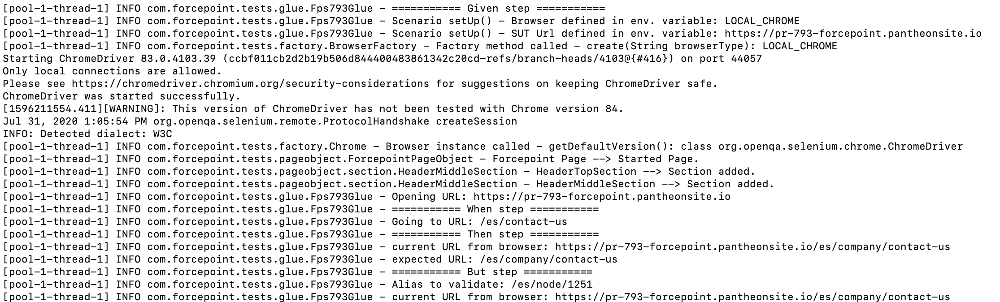
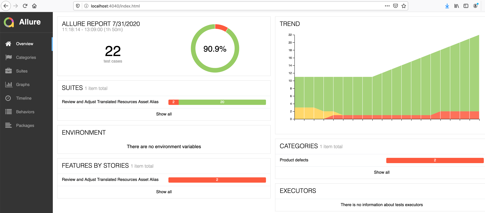
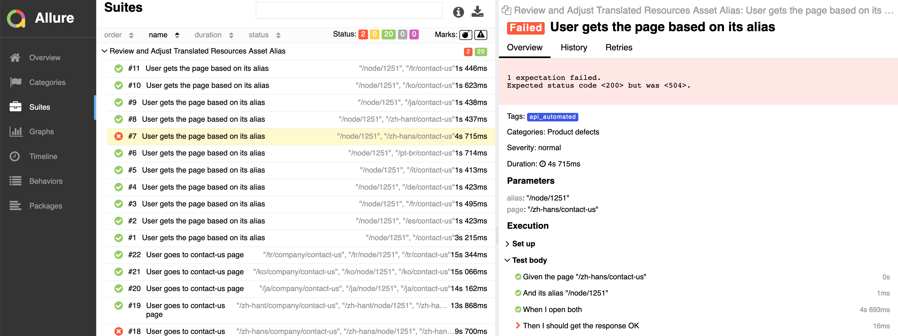

# Forcepoint Tests


### Prerequisites

* [Java8](https://www.java.com/en/download/)
* If you want to run the scenarios from command line, [Apache Maven](https://maven.apache.org/guides/getting-started/maven-in-five-minutes.html) is required. If not, you can use the embedded Maven plugin of an IDE such as Eclipse of IntelliJ IDEA. For more details, refer to Running the tests section.

At least one of the following choices:
* If you want to run the scenarios in BrowseStack, a [username and access key](https://www.browserstack.com/accounts/settings) is required. For more details, refer to Running the tests section.
* If you want to run the scenarios using a local browser, currently the one supported out of the box is Chrome. You will need the latest browser version and the latest [ChromeDriver](https://chromedriver.chromium.org/downloads) installed.

Optional:
* An IDE of your choice. For this readme [Eclipse](https://www.eclipse.org/downloads/) was used. 
* If you want to visualize execution reports, or if you want to run the tests in a container which does not require a local browser nor BrowserStack access, please install [Docker](https://www.docker.com/get-started)

### Installing

Clone the repository
```
$ git clone https://github.com/youonlylivetwice/ForcepointTests.git
```

If you want to see how [Allure](http://allure.qatools.ru/) reporting looks, run
```
$ docker-compose up
```

### Running the tests

To run API tests
```
mvn clean test -Dcucumber.options="--tags @<API test tag>" -DsutUrl=<Environment>
```
Where the variables are:
**cucumber.options:** This is the CucumberJVM hook intended to inject parameters to control execution. In this case it says which tag to run. So all scenarios labeled with
that tag will run exclusivelly.
**sutUrl:** The environment URL on which the test cases are going to run. 


To run tests using a browser:
```
$ mvn clean test -Dcucumber.options="--tags @<tag to run>" -DbrowserType=<Local, dockerized or remote browser> -Dwebdriver.chrome.driver=/path/to/Chromedriver/chromedriver -DsutUrl=<Environment>
```

Where the variables are:
**cucumber.options:** This is the CucumberJVM hook intended to inject parameters to control execution. In this case it says which tag to run. So all scenarios labeled with
that tag will run exclusivelly.
**browserType:** Use one of the following values:
* LOCAL_CHROME: This option employs the Chrome installed locally. It will require the variable webdriver.chrome.driver, also.
* REMOTE_CHROME: This option uses the dockerized Chrome, so before running the test with this option is required to run Docker Compose to load the container.
* BROWSERSTACK: This option runs the tests in the BrowserStack cloud. For more details refer to the following step.
**webdriver.chrome.driver:** This variable is required only in case of running a local Chrome (-DbrowserType=LOCAL_CHROME). It will tell the browser where the driver binary is.
**sutUrl**: The environment URL on which the test cases are going to run.

To run the tests using BrowserStack:
```
$ mvn clean test -Dcucumber.options="--tags @<tag to run>" -DbrowserType=BROWSERSTACK -DbrowserName=<Any browser from BrowserStack> -DbrowserVersion=<A version> -DuserName=<Your username in BrowserStack> -DaccessKey=<Your access key> -DsutUrl=<Environment>
```

The differences in the variables and their names are self explanatory.


To Run the tests from the embedded maven in the IDE:
* Go to Run / Run Configurations / Maven Build / New Configutarion.
* Define a config name, then press Workspace button for Base Directory, test goal and finally add the env variables according to your needs.

### Running the reports
Once the Docker compose script is running and a test suite was run, go to http://localhost:4040 and you'll find the execution result captured by Allure.


### Screenshots




## Built With

* [Docker](https://www.docker.com/get-started)
* [Cucumber JVM](https://cucumber.io/tools/cucumber-open/)
* [WebDriver](https://www.selenium.dev/)
* [JUnit](https://junit.org/junit5/)
* [Hamcrest](http://hamcrest.org/JavaHamcrest/)
* [Allure](http://allure.qatools.ru/)
